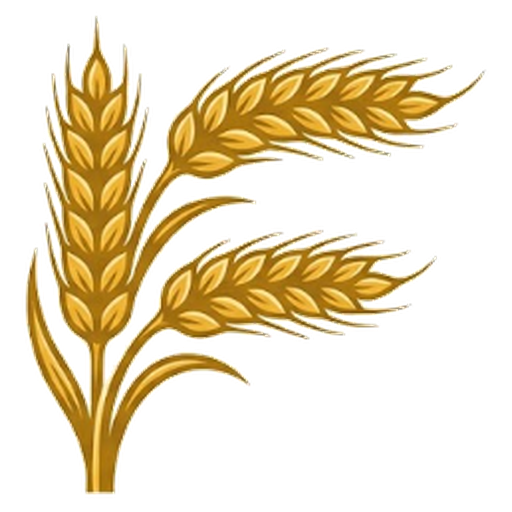

# Farm Client

**Minecraft launcher + Fabric QoL mod, built as one product.**
**Лаунчер Minecraft и QoL-мод на Fabric — единым продуктом.**

[**Сайт / Website**](https://r2d27829.github.io/Farm-Client/) · [**Скачать / Download**](https://github.com/R2D27829/Farm-Client/releases/latest) · [Changelog](CHANGELOG.md)

[Русский](#-русский) · [English](#-english)

---

## 🇷🇺 Русский

### О проекте
Farm Client — лаунчер Minecraft и клиентский Fabric-мод, которые работают в связке. Лаунчер ставит Minecraft, загрузчик, Java и моды; мод получает от лаунчера аккаунт, Discord, друзей и настройки и отдаёт обратно события из игры.

Текущие версии: **лаунчер 1.17.0**, **мод 1.32.0**.

### Возможности

**Лаунчер**
- **Версии и загрузчики** — Vanilla (включая снапшоты), Fabric, Quilt, Forge, NeoForge. Готовые профили Fabric 1.16.5 / 1.21.4 / 1.21.11 / 26.3 с Farm Client и оптимизацией (Sodium, Lithium, FerriteCore, ModernFix, ImmediatelyFast, Krypton и др.).
- **Java** скачивается автоматически (официальные сборки Mojang, 17 / 21 / 25).
- **Аккаунты** — Microsoft, Ely.by (с 2FA) и офлайн; свой скин для Microsoft.
- **Каталоги Modrinth и CurseForge** — моды, ресурспаки, шейдеры, модпаки (`.mrpack` и CurseForge). Проверка обновлений и «Обновить всё».
- **Обмен сборками** — код `FARMPACK:` или файл `.farmpack` (манифест + конфиги, `options.txt`, локальные jar). Импорт «От друга».
- **Управление сборкой** в стиле Prism Launcher: память, JVM-аргументы, разрешение, версия загрузчика.
- **Главная** — новости, избранные серверы с пингом (SLP + SRV) и кнопкой «Зайти», статистика игры по дням и серверам.
- **Сеть** — друзья по Radmin VPN / ZeroTier / Hamachi / LAN: видно, кто в сети и какой мир открыт, «Зайти к нему», общие метки.
- **Discord** — Rich Presence (лаунчер / одиночная игра / сервер), кнопка «Присоединиться», привязка аккаунта через OAuth2, вебхук: скриншоты, краш-репорты, вход и выход с сервера.
- **Интерфейс** — темы (включая «Яблочный» Liquid Glass и «Минимализм»), свой CSS, масштаб, шрифты, мини-плеер и «Сейчас играет» (Spotify / Яндекс Музыка / любой медиаплеер Windows), трей, автообновление, свой установщик.
- **Локализация** — русский и английский (лаунчер, установщик, мод).

**Мод (Fabric)**
- ClickGUI в трёх стилях, свои вкладки, редактор HUD с раскладками (слоты 1–3, `Ctrl+C/V` — код `FARMHUD:`, выравнивание `L/R`).
- **Профили серверов** — набор модулей и биндов запоминается для каждого сервера.
- Метки (Waypoints) с обменом между друзьями, Mini Player, PvP Stats, Aim Trainer, TNT Timer, Хитбоксы, 4:3, Auction Helper, SMP Helper и десятки других модулей.
- Клавиша «Скрин в Discord» — снимок окна уходит в канал через лаунчер.

### Быстрый старт
1. Скачай `FarmClient-Setup-<версия>.exe` из [Releases](https://github.com/R2D27829/Farm-Client/releases/latest).
2. Войди (Microsoft / Ely.by / офлайн).
3. Выбери версию → **Играть**. Всё остальное скачается само.

> SmartScreen может предупредить о неподписанном файле: «Подробнее» → «Выполнить в любом случае».

### Где лежат данные
- Игра: `%APPDATA%\.farmclient` (меняется в настройках), сборки — `instances\<id>`
- Настройки лаунчера: `%APPDATA%\Farm Client\settings.json`

---

## 🇬🇧 English

### About
Farm Client is a Minecraft launcher and a client-side Fabric mod that work as a pair. The launcher installs Minecraft, the mod loader, Java and mods; the mod receives the account, Discord, friends and settings from the launcher and reports in-game events back.

Current versions: **launcher 1.17.0**, **mod 1.32.0**.

### Features

**Launcher**
- **Versions & loaders** — Vanilla (incl. snapshots), Fabric, Quilt, Forge, NeoForge. Ready Fabric profiles for 1.16.5 / 1.21.4 / 1.21.11 / 26.3 with Farm Client and a performance stack (Sodium, Lithium, FerriteCore, ModernFix, ImmediatelyFast, Krypton, etc.).
- **Java** is downloaded automatically (official Mojang runtimes 17 / 21 / 25).
- **Accounts** — Microsoft, Ely.by (2FA supported) and offline; custom skin upload for Microsoft.
- **Modrinth & CurseForge** — mods, resource packs, shaders, modpacks (`.mrpack` and CurseForge). Update checks and one-click "Update all".
- **Pack sharing** — a `FARMPACK:` code or a `.farmpack` file (manifest + configs, `options.txt`, local jars). "From a friend" import.
- **Per-instance management** à la Prism Launcher: memory, JVM args, resolution, loader version.
- **Home** — news, favourite servers with live ping (SLP + SRV) and "Join", playtime stats by day and server.
- **Network** — friends over Radmin VPN / ZeroTier / Hamachi / LAN: who is online, open worlds, "Join them", shared waypoints.
- **Discord** — Rich Presence (launcher / singleplayer / server), "Join" button, OAuth2 account linking, webhook for screenshots, crash reports, server join/leave.
- **UI** — themes (incl. "Apple" Liquid Glass and "Minimal"), custom CSS, scaling, fonts, mini player and Now Playing (Spotify / Yandex Music / any Windows media session), tray, auto-updates, custom installer.
- **Localization** — Russian and English (launcher, installer, mod).

**Mod (Fabric)**
- ClickGUI in three styles, custom tabs, HUD editor with layouts (slots 1–3, `Ctrl+C/V` as a `FARMHUD:` code, `L/R` stacking).
- **Server profiles** — module and keybind sets remembered per server.
- Waypoints with friend sharing, Mini Player, PvP Stats, Aim Trainer, TNT Timer, Hitboxes, 4:3, Auction Helper, SMP Helper and dozens more modules.
- "Screenshot to Discord" key — the window capture is posted through the launcher.

### Quick start
1. Download `FarmClient-Setup-<version>.exe` from [Releases](https://github.com/R2D27829/Farm-Client/releases/latest).
2. Sign in (Microsoft / Ely.by / offline).
3. Pick a version → **Play**. Everything else is downloaded automatically.

> SmartScreen may warn about an unsigned binary: "More info" → "Run anyway".

### Data locations
- Game: `%APPDATA%\.farmclient` (configurable), instances in `instances\<id>`
- Launcher settings: `%APPDATA%\Farm Client\settings.json`

---

Farm Client is not affiliated with Mojang Studios or Microsoft. Minecraft is a trademark of Mojang Synergies AB.

